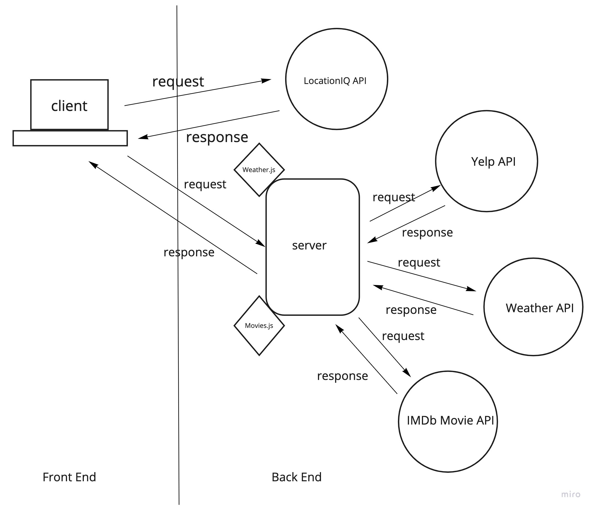

# city-explorer-api

**Author**: Riki Plaza
**Version**: 3.0.0 (increment the patch/fix version number if you make more commits past your first submission)
**version**: 4.0.0
**Version**: 5.0.0

## Overview
<!-- Provide a high level overview of what this application is and why you are building it, beyond the fact that it's an assignment for this class. (i.e. What's your problem domain?) -->
Create a app that renders a city and the 3 day forcast for selected city.

## Getting Started
<!-- What are the steps that a user must take in order to build this app on their own machine and get it running? -->
Plan out how they want to go about coding this app, what features they want and which they don't. Build a WRRC to visually see what they are trying to do.

## Architecture
<!-- Provide a detailed description of the application design. What technologies (languages, libraries, etc) you're using, and any other relevant design information. -->
REACT, Express, Javascript. Axios

## Change Log
<!-- Use this area to document the iterative changes made to your application as each feature is successfully implemented. Use time stamps. Here's an example:

01-01-2001 4:59pm - Application now has a fully-functional express server, with a GET route for the location resource. -->
06/22/2022 started the lab
06/29/2022 finished lab 1800

## Credit and Collaborations
<!-- Give credit (and a link) to other people or resources that helped you build this application. -->

## Name of feature: Readme

## Estimate of time needed to complete: 5 minutes

## Start time: 1500

## Finish time: 2100

## Actual time needed to complete: 9 hours

Lab 7 Partner: Jamal Malik

## Name of feature: Added movie app key worked on server.js lab 8 

## Estimate of time needed to complete: 6 hours

## Start time: 1500

## Finish time: 2100

## Actual time needed to complete: 6 hours

## Name of feature: Refactor lab 9

## Estimate of time needed to complete: 6 

## Start time: 1500

## Finish time: 2100

## Actual time needed to complete: Refactor